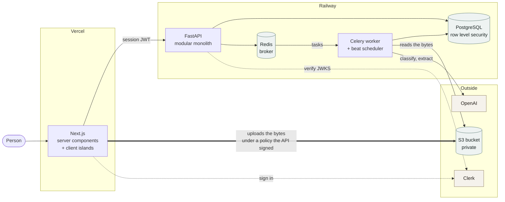
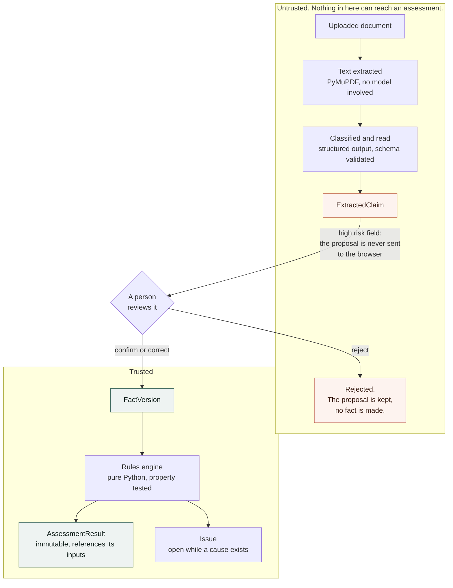
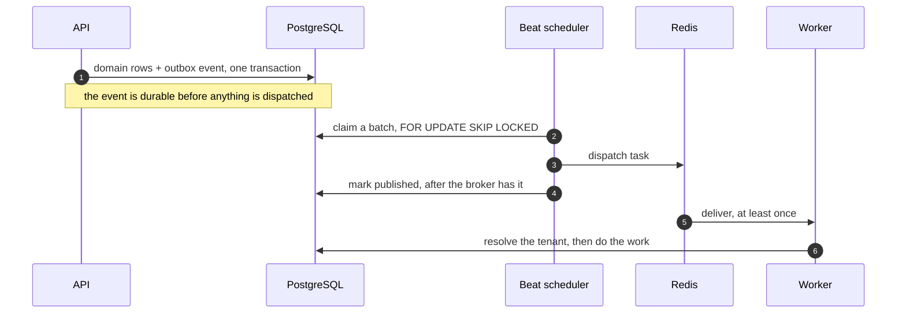

# Architecture overview

Three diagrams: what runs where, what happens to model output before it can affect
anything, and how a write turns into background work.

The data model is not repeated here. It is an ER diagram in
[`DOMAIN_MODEL_RFC.md`](DOMAIN_MODEL_RFC.md) §54. The reasoning behind the stack is in
[the technical architecture RFC](Evidence_First_Citizenship_Workspace_Technical_Architecture_RFC.md).

## What runs where

One deployable backend, not a set of services. Module boundaries are enforced in the
codebase rather than over the network: `cases`, `applicants`, `residence`, `evidence`,
`facts`, `requirements`, `assessments`, `issues`, `ai`, `auth`, `core`, `shared`. Cross
module work goes through a service or a repository. No module reaches into another
module's tables.

**The upload does not pass through the API.** The API signs a POST policy. The browser then
sends the bytes straight to the bucket.

Two things follow from that. The size limit is a condition inside the signed policy, so the
store refuses an oversized file rather than the API noticing afterwards. And the bucket
needs a CORS rule, because without one every upload fails at preflight while the API logs
look clean.

The storage key comes back in a signed token rather than a plain field. A client that can
edit the key can point it at someone else's document.

The worker runs its own scheduler. Without `--beat` nothing is relayed, so uploaded
documents are never read and deleted ones are never purged. Nothing reports an error.

## The path model output takes

Everything a model produces is a proposal until a person acts on it.

Three rules the code enforces, rather than conventions:

**An unreviewed claim cannot reach an assessment.** There is no arrow across the boundary
because there is no code path across it. The rules engine takes facts and versioned inputs.
It has no parameter a claim could arrive through, so a type signature carries the rule
instead of a check someone could delete.

**Correcting keeps what was proposed.** A correction writes the person's value as the fact
and keeps the model's original on the claim. The disagreement stays visible afterwards.

**A date is never shown to the person before they read it.** For high risk claims the API
sends `proposed_value` as null. The person reads the document and types what it says, and
the system works out from that entry whether it was a confirmation or a correction. An
ambiguous date such as `03/04/2025` is refused from a person for the same reason it is
refused from a model.

Text extraction is deterministic and text only. A scan with no text layer gives nothing to
read, and the screen says so rather than guessing. There is no vision fallback.

## How a write becomes background work

Reading a document takes about twenty seconds, so it cannot happen during the request. The
job also must not be lost if the process dies between committing the row and queueing the
work. That is what the outbox is for.

The commit comes after the dispatch on purpose. If `published_at` became durable first, a
crash in between would lose the job silently.

Delivery is therefore at least once, and every task is written to survive a second one. A
purge finds the row already tombstoned and returns. Processing is keyed, so a duplicate
cannot create a second run.

## Boundaries that matter

**Determinism.** Date calculations, threshold comparisons and readiness states live in
`app/requirements/` as ordinary Python, covered by Hypothesis property tests. Prompts decide
nothing. A model never sees a threshold and never returns a conclusion.

**The tenant.** Ownership is checked in the service layer on every case scoped command.
PostgreSQL row level security is the second line: requests run as a non superuser role with
the tenant set per transaction, so a query that forgets the check returns nothing rather
than someone else's rows.

The worker has no request to inherit a tenant from. It reads one from the database through a
`SECURITY DEFINER` function that takes an id and returns an owner, and does nothing else.

**Assessment history.** Results are never edited. Changing an input marks the conclusions
that declared a dependency on it stale. Recalculating writes new results and leaves the old
ones readable, with the rule version that produced them. Conclusion and currency are
separate fields, so a result can be `SUPPORTED` and `STALE` at the same time.
