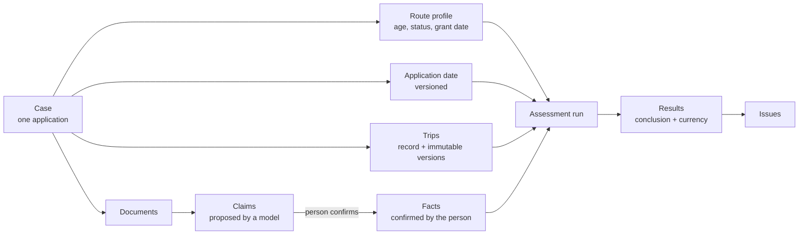
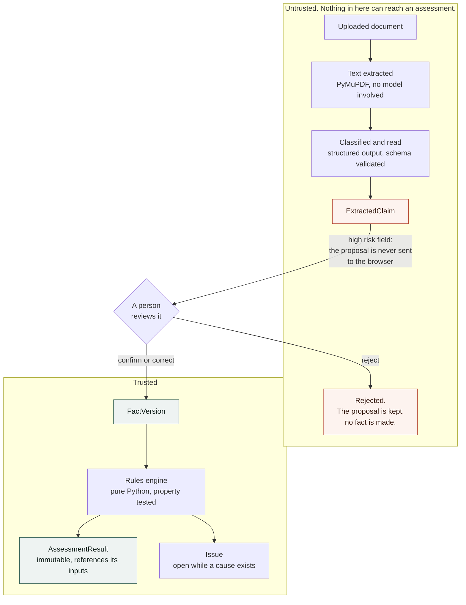
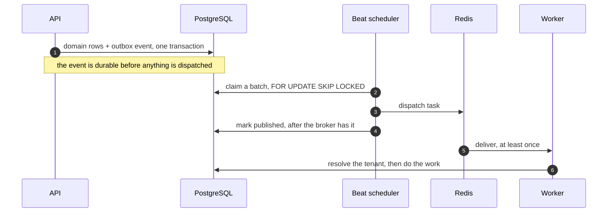

# Architecture overview

The one document to read. It explains how the system works, in about fifteen minutes.

The three specifications next to it are **reference**, not reading: the code cites them by
section number, so they are where you look up a detail or the reasoning behind it. The
table at the end says which one answers which question.

## 1. What it does

A person with settled status prepares a UK citizenship application on the standard
five-year route. They enter their application date, their trips abroad and their documents.
The system checks each requirement with deterministic rules and shows the result, how it was
worked out, and what it depends on.

Two ideas shape everything:

- **A model's output is a proposal, never a fact.** Values read from a document count only
  after the person confirms or corrects them.
- **Rules are code, not prompts.** Every date, count and threshold is ordinary Python with
  tests. No model ever decides a result.

## 2. What runs where


One deployable backend, not a set of services. Module boundaries are enforced in the
codebase rather than over the network: `cases`, `applicants`, `residence`, `evidence`,
`facts`, `requirements`, `assessments`, `issues`, `ai`, `auth`, `core`, `shared`. Cross
module work goes through a service or a repository. No module reaches into another
module's tables.

**The upload does not pass through the API.** The API signs a POST policy and the browser
sends the bytes straight to the bucket. The size limit is a condition inside that signed
policy, so the store refuses an oversized file itself. The bucket needs a CORS rule, or every
upload fails at preflight while the API logs look clean.

The storage key comes back in a signed token rather than a plain field. A client that could
edit the key could point it at someone else's document.

The worker runs its own scheduler. Without `--beat` nothing is relayed, so uploaded
documents are never read and deleted ones never purged, and nothing reports an error.

## 3. The model on one page



| Thing | What it is | The one fact worth remembering |
|---|---|---|
| **Case** | One application, owned by one person | The ownership boundary for every read and write |
| **Trip** (`TravelRecord`) | A period outside the UK | Editing appends an immutable version; removing leaves a tombstone |
| **Claim** (`ExtractedClaim`) | A value a model read from a document | Untrusted. Never reaches a rule |
| **Fact** (`FactVersion`) | A value the person confirmed or corrected | The only way document data becomes an input |
| **Assessment run / result** | One evaluation, one result per requirement | Never edited. A new run writes new results |
| **Conclusion** | What a result says: Supported, Near threshold, and so on | The screen calls this the *result* |
| **Currency** | Whether a result is up to date: Current, Stale, Superseded, Provisional | The screen says *out of date* for Stale |
| **Issue** | Something for the person to act on or know | Opened and closed by reconciling against its cause |

**Conclusion and currency are separate.** A result can be Supported and Stale at once: the
answer it gave, and the fact that something it depends on has changed since.

Every result links to the exact input versions and rule version it was computed from
(`AssessmentInputLink`). That is how a requirement page can show "the trips this read" even
after those trips were edited.

## 4. How the rules work

Nine of the fifteen catalogued requirements are evaluated: three route checks, the
settled-status holding period, and five residence checks. The other six (knowledge of
English and life in the UK, the two referees, good character, overall readiness) are shown
as **not yet assessed**, which is true, rather than hidden.

**The qualifying period, and the +1 day.** The period is the five years *ending with* the
application date, both ends included, so it starts the day after the same date five years
earlier:

```
start = application_date − 5 years + 1 day
end   = application_date
```

A naive `application_date − 5 years` is wrong by exactly one day, and that day is where the
person must have been in the UK. This is the single most important test in the suite.

**How days abroad are counted.** A trip is a *set* of absent days: every day strictly
between departure and return. Travel days count as days in the UK, as the guidance says.
Totals are the size of the union of those sets inside the window. Overlapping or duplicated
trips therefore never double count, and adding a day can never lower a total.

**Which trips count.** Only trips that are active, confirmed and have exact dates go into
the confirmed totals. Everything else (estimated dates, unconfirmed, disputed by a
document) is held back and shown separately. If a held-back trip would change the result, the
result says so rather than quietly ignoring it.

**Thresholds become bands, not pass or fail.**

| Days abroad | Whole five years | Final 12 months |
|---|---|---|
| Within the standard threshold | up to 420 | up to 75 |
| Near threshold | 421 to 450 | 76 to 90 |
| Requires judgement (guidance normally allows discretion) | 451 to 480 | 91 to 100 |
| Professional review recommended | 481 to 900 | 101 to 179 |
| Not currently satisfied, plus review | over 900 | 180 or more |

Going over 450 is deliberately **not** a failure: guidance says discretion is normally used
up to 480. Stopping and recommending review is a successful outcome here, not an error.

## 5. The path model output takes

Everything a model produces is a proposal until a person acts on it.



Three rules the code enforces, rather than conventions:

**An unreviewed claim cannot reach an assessment.** There is no arrow across the boundary
because there is no code path across it. The rules engine takes facts and versioned inputs,
and has no parameter a claim could arrive through.

**Correcting keeps what was proposed.** A correction writes the person's value as the fact
and keeps the model's original on the claim, so the disagreement stays visible.

**A date is never shown to the person before they read it.** For high risk claims the API
sends `proposed_value` as null. The person types what the document says, and the system
works out whether that was a confirmation or a correction. An ambiguous date such as
`03/04/2025` is refused from a person for the same reason it is refused from a model.

## 6. How results go out of date

Each rule declares which kinds of input it reads (the application date, trips, the route
profile, facts, attached documents). When one of those changes, every current result whose
rule declared it is marked **stale in the same transaction** as the change. Results of rules
that did not declare it are left alone, so editing a trip never stales the route checks.

Updating the assessment writes a new run and new results. The old results stay readable,
with the rule version that produced them, as the requirement's history.

A save that changes nothing a rule reads stales nothing: a trip's reason, for example, lives
on the stable record rather than on the version (ADR-0035).

## 7. How a write becomes background work

Reading a document takes about twenty seconds, so it cannot happen inside the request. The
job must also survive the process dying between committing the row and queueing the work.
That is what the outbox is for.



The commit comes after the dispatch on purpose. If `published_at` became durable first, a
crash in between would lose the job silently. Delivery is therefore at least once, and every
task survives a second delivery: a purge finds the row already tombstoned and returns, and
processing is keyed so a duplicate cannot create a second run.

## 8. The document pipeline and the AI

A document moves through these states, shown to the person as they happen: Uploaded,
Validating, Reading, Analysing, then one of Needs your confirmation, Text read, No text
found, Unsupported or Failed.

1. **Validate** the file: type, size and checksum. Nothing is read from an invalid file.
2. **Extract text** with PyMuPDF. Deterministic, no model. A scan with no text layer gives
   nothing to read, and the screen says so; there is no vision fallback.
3. **Classify** the document (`DocumentClassifier`). The person's own choice of type is
   kept; the model's view is shown beside it only when they differ.
4. **Extract claims** with the capability for that kind of document:
   `TravelRecordExtractor`, `EnglishLanguageExtractor` or `LifeInUkExtractor`
   (ADR-0029). Output is structured and schema validated before any claim is stored.

**Narrow capabilities, not one AI function.** Each capability has its own prompt version,
output schema, model configuration and evaluation fixtures. They all go through one small
provider adapter, which exists for control and testing rather than to support many
providers.

**Every model call is recorded** (`model_runs`): capability, model, prompt and schema
version, tokens, cost, latency, status and a hash of the output. Never the document's text.

**Retries** cover temporary failures (timeouts, rate limits, network, storage). Unsupported
files, corrupted files and repeatedly invalid output are not retried.

Document content is data, never instructions. It never enters the system prompt, and the
schema validation is what stops injected text from becoming a claim.

## 9. Boundaries that matter

**Determinism.** Date calculations, threshold comparisons and result states live in
`app/requirements/` as ordinary Python, covered by Hypothesis property tests. A model never
sees a threshold and never returns a result.

**The tenant.** Ownership is checked in the service layer on every case scoped command.
PostgreSQL row level security is the second line: requests run as a non superuser role with
the tenant set per transaction, so a query that forgets the check returns nothing rather
than someone else's rows. The worker has no request to inherit a tenant from, so it reads
one through a `SECURITY DEFINER` function that takes an id and returns an owner, and does
nothing else.

**Derived, not stored.** The case phase, the next steps and the "application date has
passed" notice are worked out on every read from what the case holds (ADR-0009, ADR-0032,
ADR-0034). They cannot go out of date because they are never saved.

## 10. The stack, and what was rejected

| Layer | Choice |
|---|---|
| Web | Next.js (App Router), TypeScript, TanStack Query, a hand built design system (ADR-0031) |
| API | Python, FastAPI, Pydantic, SQLAlchemy 2, Alembic |
| Background work | Celery with Redis, fed by a transactional outbox |
| Data | PostgreSQL with row level security; private S3 compatible storage (MinIO locally) |
| AI | The OpenAI SDK behind a small adapter, structured outputs, versioned prompts |
| Platform | Clerk for sign in, Docker Compose locally, GitHub Actions, Vercel and Railway |

Rejected on purpose, each for the same reason: it adds complexity the product does not need.

- **A Next.js only backend.** Long document work and the Python document and AI tooling
  belong in a real backend.
- **Microservices or Kubernetes.** One tightly connected domain; provenance is simpler in
  one transactional application.
- **LangChain, LangGraph or any agent framework.** The workflows are deterministic; direct
  calls are easier to inspect, test and evaluate.
- **A vector or graph database.** The guidance corpus is small, and the evidence graph's
  relationships are known, so relational joins are enough.
- **Full event sourcing.** Immutable versions and assessment runs already give the history.
- **Custom authentication.** Not a differentiator, and a security risk to build.

## 11. Where to look

| Question | Where |
|---|---|
| What exactly is each entity, field and enum? | [Domain model RFC](DOMAIN_MODEL_RFC.md) §7 to §40 |
| When does a result go stale, and what does it reach? | Domain model RFC §41, ADR-0014 |
| Trusted versus provisional (the date preview) | Domain model RFC §42 |
| Read models: overview, requirement page, issues, next steps | Domain model RFC §44 |
| How deletion works, and what is kept | Domain model RFC §51 |
| Why the window starts a day later | [Rules spec](DETERMINISTIC_RULES_SPEC.md) §3 |
| How days abroad are counted | Rules spec §5 |
| Which trips count towards totals | Rules spec §6 |
| Each requirement's rule and bands | Rules spec §7 |
| Which rule reads which input | Rules spec §8 |
| The worked example the tests assert | Rules spec §9 |
| How a document becomes claims, and claims facts | [Evidence and claim lifecycle RFC](EVIDENCE_AND_CLAIM_LIFECYCLE_RFC.md) §5 to §13 |
| What happens when a document is replaced or deleted | Evidence lifecycle RFC §18 to §20 |
| Why a conflict is worked out rather than stored | Evidence lifecycle RFC §42 |
| Why a specific decision was made | [Decisions](../decisions/) (indexed in [docs/README](../README.md)) |

The original technical architecture RFC, which proposed this stack, is retired. Its lasting
content is in sections 8 and 10 above; the full text is in git history
(`git show c030f62:docs/architecture/Evidence_First_Citizenship_Workspace_Technical_Architecture_RFC.md`).
