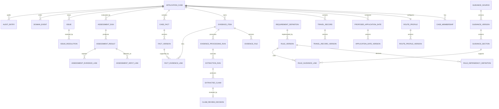

# Evidence-First Citizenship Workspace

## Domain Model RFC

### Status

Proposed for implementation  
Version: 0.1  
Project: Evidence-First Citizenship Workspace  
Initial route: UK naturalisation under Section 6(1), standard five-year route

---

## 1. Purpose

This RFC defines the domain model for the first production-quality version of Evidence-First Citizenship Workspace.

It establishes the shared language and invariants used by:

- the PostgreSQL schema;
- FastAPI modules;
- deterministic rules;
- asynchronous workers;
- OpenAPI contracts;
- the Next.js interface;
- AI extraction capabilities;
- evaluation fixtures;
- audit and observability.

The domain model must preserve the product's central promise:

> Every readiness assessment can be traced to exact applicant inputs, confirmed facts, supporting evidence, a versioned rule, visible limitations, and an explicit next action.

This RFC is intentionally more precise than the product thesis and broader than a database schema. It defines domain meaning, ownership, lifecycle, and behaviour.

---

## 2. Decision Summary

The domain will use:

- one `ApplicationCase` as the top-level user-owned workspace;
- explicit typed records for residence, evidence, referees, and case facts;
- immutable versions for assessed inputs;
- a strict distinction between AI-extracted claims and user-confirmed facts;
- immutable assessment runs and results;
- explicit dependency links from assessments to exact input versions;
- separate assessment conclusion and assessment currency;
- relational provenance rather than a graph database;
- versioned requirement rules and official guidance;
- issues as actionable domain objects;
- append-only domain events and audit entries;
- mutable current projections derived from immutable history;
- no full event sourcing.

The public interface may present a simple current state, but the domain must retain enough history to explain how that state was reached.

---

## 3. Domain Principles

### 3.1 The case is the ownership boundary

Every personal record belongs to exactly one `ApplicationCase`.

No case-scoped object may be read or changed without verifying:

- authenticated user;
- case membership;
- object-to-case relationship.

Case ownership must not be inferred from an object identifier alone.

---

### 3.2 Claims are not facts

An AI-extracted value is an observation proposed by a model.

It is not a trusted case input until the user:

- confirms it;
- corrects it; or
- independently enters the corresponding fact.

```text
Evidence
   ↓
ExtractedClaim
   ↓ user review
FactVersion
   ↓
AssessmentResult
```

Unreviewed claims must never influence a trusted assessment.

---

### 3.3 Assessed inputs are versioned

Any input that can affect an assessment must have an immutable version.

Examples:

- immigration status grant date;
- proposed application date;
- travel record;
- Life in the UK completion;
- language evidence state;
- referee completion.

The system may update which version is current, but it must never mutate a version already used by an assessment.

---

### 3.4 Assessment history is immutable

An assessment is not edited in place.

When inputs or rules change:

1. Existing affected results become stale.
2. A new assessment run is created.
3. New results reference the new exact input versions.
4. Previous results remain inspectable.

---

### 3.5 Currency is separate from conclusion

`Supported` and `Stale` describe different dimensions.

A result can have:

- conclusion: `SUPPORTED`;
- currency: `STALE`.

This avoids losing the historical conclusion while making clear that it should no longer be relied upon.

---

### 3.6 Provenance is structural

Provenance must be represented with identifiers and relationships, not only generated prose.

An assessment explanation is built from:

- input version links;
- evidence links;
- rule version;
- guidance sections;
- limitations;
- next actions;
- optional AI-generated plain-language explanation.

---

### 3.7 Derived values are not canonical facts

Absence totals, qualifying periods, and threshold comparisons are deterministic calculation outputs.

They belong to assessment results or calculation previews.

They should not be stored as user facts.

---

### 3.8 Deletion must not create misleading confidence

When evidence or an assessed input is removed:

- dependent current results are marked stale immediately;
- linked support states are recomputed;
- a new assessment is required;
- deleted content cannot remain silently represented as available evidence.

---

### 3.9 Public demo data is synthetic

Synthetic records are first-class fixtures, not copies of real cases.

All public screenshots, seeds, tests, and demos must use synthetic identifiers and documents.

---

## 4. Bounded Contexts

The modular monolith is divided into the following bounded contexts.

```text
Application Case
├── Case Management
├── Applicant and Route
├── Residence
├── Evidence and Claims
├── Facts and Provenance
├── Requirements and Rules
├── Assessments
├── Issues
├── Guidance
└── Audit
```

### 4.1 Case Management

Owns:

- case lifecycle;
- case membership;
- supported route configuration;
- deletion;
- archive state;
- current case projection.

### 4.2 Applicant and Route

Owns:

- applicant route answers;
- age and supported-route facts;
- immigration status record;
- route support decision;
- knowledge requirement facts;
- referee records.

### 4.3 Residence

Owns:

- proposed application date;
- travel records;
- travel record versions;
- qualifying-period previews;
- overlap and consistency detection;
- residence-specific input validation.

### 4.4 Evidence and Claims

Owns:

- evidence items;
- file versions;
- processing runs;
- extraction runs;
- extracted claims;
- claim review decisions;
- source locations in documents.

### 4.5 Facts and Provenance

Owns:

- canonical case facts;
- immutable fact versions;
- evidence support links;
- source attribution;
- current fact selection.

### 4.6 Requirements and Rules

Owns:

- requirement definitions;
- route applicability;
- rule versions;
- evaluator identifiers;
- rule dependencies;
- rule-to-guidance links.

### 4.7 Assessments

Owns:

- assessment triggers;
- assessment runs;
- immutable results;
- input dependency links;
- calculation breakdowns;
- limitations;
- next actions;
- stale and superseded state.

### 4.8 Issues

Owns:

- actionable problems;
- issue causes;
- severity;
- dismissibility;
- resolution;
- reopening.

### 4.9 Guidance

Owns:

- official sources;
- source versions;
- curated sections;
- content hashes;
- retrieval dates.

### 4.10 Audit

Owns:

- append-only domain events;
- user action records;
- outbox events;
- deletion audit.

---

## 5. Shared Domain Vocabulary

| Term | Meaning |
|---|---|
| Case | A user-owned workspace for one intended naturalisation application |
| Route | The naturalisation route configured for a case |
| Assessed input | A versioned record that can influence a requirement assessment |
| Claim | An untrusted structured value proposed from evidence |
| Fact | A canonical user-confirmed or user-entered case value |
| Evidence | A document or record that may support or contradict facts |
| Requirement | A readiness question relevant to the configured route |
| Rule version | Immutable deterministic logic and metadata used to assess a requirement |
| Assessment run | A single execution of one or more rules against a defined input snapshot |
| Assessment result | Immutable conclusion for one requirement within a run |
| Limitation | A condition reducing confidence or preventing a conclusive result |
| Issue | A user-actionable problem or review item |
| Guidance version | Immutable captured version of an official source |
| Current | The latest valid state for present use |
| Stale | Previously valid output invalidated by a relevant input or rule change |
| Superseded | Historical output replaced by a newer completed output |

---

## 6. Identifier and Time Conventions

### 6.1 Identifiers

Use UUIDv7 where supported, otherwise UUIDv4.

All public APIs use opaque identifiers.

Never encode:

- user identity;
- case type;
- creation date;
- document location;

inside a public identifier.

### 6.2 Calendar Dates

Naturalisation and travel dates use a database `DATE`, not timestamp.

Examples:

- date of birth;
- status granted date;
- proposed application date;
- departure date;
- return date;
- test completion date.

Date interpretation and absence-counting semantics belong to the Deterministic Rules Specification.

### 6.3 Audit Timestamps

Audit and processing timestamps use UTC `TIMESTAMPTZ`.

Examples:

- created at;
- confirmed at;
- processing started at;
- assessment completed at;
- marked stale at.

### 6.4 Optimistic Concurrency

Mutable aggregate roots include an integer `revision`.

Commands that change an aggregate must provide the expected revision.

A stale revision returns a conflict rather than silently overwriting another change.

---

## 7. ApplicationCase Aggregate

`ApplicationCase` is the top-level ownership and lifecycle aggregate.

### 7.1 Fields

```text
ApplicationCase
├── id
├── owner_user_id
├── title
├── route_key
├── lifecycle_status
├── support_status
├── current_phase
├── current_proposed_application_date_id
├── created_at
├── updated_at
├── archived_at
├── deletion_requested_at
└── revision
```

### 7.2 Route Key

Initial supported value:

```text
SECTION_6_1_STANDARD
```

The enum may anticipate additional routes, but no unsupported route may create assessments.

### 7.3 Lifecycle Status

```text
DRAFT
ACTIVE
ARCHIVED
DELETION_PENDING
DELETED
```

#### `DRAFT`

The case exists but route onboarding is incomplete.

#### `ACTIVE`

The route is supported and the case can be assessed.

#### `ARCHIVED`

The case is read-only to the user, except restore or delete.

#### `DELETION_PENDING`

Deletion has been requested. New writes and processing are blocked.

#### `DELETED`

Personal records and stored files have been removed. Only a minimal non-identifying deletion audit may remain.

### 7.4 Route Support Status

```text
NOT_EVALUATED
SUPPORTED
UNSUPPORTED
REQUIRES_REVIEW
```

`REQUIRES_REVIEW` means the product cannot safely map the supplied route answers to the supported standard route.

### 7.5 Current Phase

The case phase is a user-facing projection:

```text
SETTING_UP
BUILDING_CASE
RESOLVING_ISSUES
NEARLY_PREPARED
FINAL_REVIEW
```

The phase is derived from case state, assessments, and issues.

It is not legal eligibility.

### 7.6 Invariants

- A case has exactly one owner in the MVP.
- A case in `DELETION_PENDING` or `DELETED` cannot accept new evidence or assessments.
- Assessments may only run when `support_status = SUPPORTED`.
- `route_key` cannot change after trusted assessments exist. A route change requires a new case.
- A case cannot be marked `ACTIVE` until route onboarding is complete.
- The current phase must never be represented as a percentage.

### 7.7 Commands

- `CreateCase`
- `CompleteRouteOnboarding`
- `ArchiveCase`
- `RestoreCase`
- `RequestCaseDeletion`
- `CompleteCaseDeletion`

---

## 8. Case Membership

The MVP supports one owner, but authorisation is represented explicitly.

```text
CaseMembership
├── case_id
├── user_id
├── role
├── created_at
└── revoked_at
```

Initial role:

```text
OWNER
```

Future adviser or collaborator roles must not be introduced without a separate RFC.

---

## 9. RouteProfile Aggregate

`RouteProfile` stores onboarding answers used to determine whether the MVP route is supported.

### 9.1 Fields

```text
RouteProfile
├── id
├── case_id
├── current_version_id
├── created_at
└── revision
```

```text
RouteProfileVersion
├── id
├── route_profile_id
├── version_number
├── date_of_birth
├── status_type
├── status_granted_on
├── married_to_british_citizen
├── may_already_be_british
├── review_state
├── created_by
├── created_at
└── supersedes_version_id
```

### 9.2 Status Type

```text
ILR
ILE
EU_SETTLED_STATUS
OTHER
UNKNOWN
```

### 9.3 Review State

```text
DRAFT
CONFIRMED
```

Only confirmed route profile versions may be used in route support decisions or assessments.

### 9.4 Invariants

- The date of birth cannot be in the future.
- `status_granted_on` is required for supported status types.
- A profile marked `CONFIRMED` is immutable.
- Editing creates a new version.
- `married_to_british_citizen = true` results in an unsupported MVP route.
- `may_already_be_british = true` prevents automatic support and creates a review outcome.
- Route support must be recalculated when the current confirmed profile changes.

---

## 10. ProposedApplicationDate Aggregate

A case may compare multiple candidate dates, but exactly one may be current.

### 10.1 Fields

```text
ProposedApplicationDate
├── id
├── case_id
├── current_version_id
├── is_current
├── created_at
└── revision
```

```text
ProposedApplicationDateVersion
├── id
├── proposed_application_date_id
├── version_number
├── application_date
├── review_state
├── source
├── created_by
├── created_at
└── supersedes_version_id
```

### 10.2 Source

```text
USER_ENTERED
SYSTEM_SUGGESTED
```

A system-suggested date must still be explicitly selected by the user.

### 10.3 Invariants

- A supported active case has at most one current proposed date.
- A confirmed date version is immutable.
- Changing the current date marks dependent assessment results stale in the same transaction.
- Previewing another date does not change the case or mark assessments stale.
- Date simulations produce ephemeral calculation previews unless the user saves the date.

---

## 11. TravelRecord Aggregate

A `TravelRecord` represents one reported period outside the UK.

### 11.1 Stable Record

```text
TravelRecord
├── id
├── case_id
├── current_version_id
├── lifecycle_status
├── created_at
├── updated_at
└── revision
```

### 11.2 Immutable Version

```text
TravelRecordVersion
├── id
├── travel_record_id
├── version_number
├── destination_country_code
├── destination_label
├── departure_date
├── return_date
├── date_confidence
├── review_state
├── entry_source
├── notes
├── created_by
├── created_at
└── supersedes_version_id
```

### 11.3 Lifecycle Status

```text
ACTIVE
REMOVED
```

Removal creates a tombstone state and domain event. It does not mutate old versions.

### 11.4 Date Confidence

```text
EXACT
ESTIMATED
CONFLICTING
UNKNOWN
```

### 11.5 Review State

```text
DRAFT
CONFIRMED
UNCERTAIN
```

### 11.6 Entry Source

```text
MANUAL
CSV_IMPORT
CONFIRMED_CLAIM
CORRECTED_CLAIM
```

### 11.7 Trusted and Provisional Use

#### Trusted assessment

Uses current travel versions where:

```text
review_state = CONFIRMED
date_confidence = EXACT
lifecycle_status = ACTIVE
```

#### Provisional preview

May include:

- `UNCERTAIN`;
- `ESTIMATED`;
- unresolved conflict candidates.

Provisional output must be labelled and cannot replace the trusted current assessment.

### 11.8 Invariants

- Departure date cannot be after return date.
- An active confirmed version requires both dates.
- A confirmed exact record is immutable.
- Editing creates a new version.
- Removing or versioning a current record marks affected residence assessments stale.
- Overlapping records are permitted temporarily but create issues.
- Duplicate detection proposes an issue; it does not merge automatically.
- A travel record may link to zero or more evidence items.
- A travel record without evidence may still be user-confirmed but must expose its support state.

### 11.9 EvidenceTravelLink

The table behind the last two invariants above. Added at **M7 slice 4a**, where a document
first influences an assessment.

```text
EvidenceTravelLink
├── id
├── case_id
├── travel_record_id
├── evidence_item_id
├── availability
├── linked_at
└── unlinked_at
```

`availability` uses the §22.2 values — `AVAILABLE`, `DELETED`, `UNAVAILABLE` — and the same
reasoning: deleting a document changes a link's availability rather than removing the row,
so a historical assessment can still show what it read and say that it is no longer
available (§22.3).

**It links the record, not the version.** A travel record is versioned and editing a trip's
dates creates a new version. What the booking evidences is *the trip*, not one revision of
its dates, so linking `travel_record_version_id` would drop every attachment on every edit —
a user correcting a return date would find their evidence silently gone. This is the
opposite choice to `FactEvidenceLink` (§22), which links a fact *version*, and the
difference is not inconsistency: a fact's value is the thing being evidenced, so a new value
genuinely needs re-evidencing. A trip's identity survives a date correction.

**Relationship to `FactEvidenceLink`.** Both exist; neither replaces the other. This one
attaches a document to a user-entered travel record and is available from M7. That one
attaches a document to a fact version and arrives with facts in M8. Rules asking "is this
evidenced?" ask it of *available links of any kind* — see DETERMINISTIC_RULES_SPEC §7.8 —
so M8 widens the graph rather than rewriting the rule.

**Invariants**

- A link belongs to exactly one case, and both endpoints must belong to that same case.
- A link points at an active evidence item; a deleted item's links become `DELETED`.
- Coverage is derived from links whose availability is `AVAILABLE`.
- Removing or restoring a link marks assessments declaring `EVIDENCE_SUPPORT` stale
  (§25.1), in the same transaction as the link change.
- A link is not a judgement that the document is the *right* document. Nothing in M7
  inspects a linked document's contents to decide whether it supports the trip; that is a
  model's job and belongs to M8.

---

## 12. KnowledgeRequirementRecord

Knowledge and language completion are represented as typed case records.

```text
KnowledgeRequirementRecord
├── id
├── case_id
├── kind
├── current_version_id
├── created_at
└── revision
```

```text
KnowledgeRequirementVersion
├── id
├── record_id
├── version_number
├── completion_state
├── completed_on
├── reference_value
├── review_state
├── created_by
├── created_at
└── supersedes_version_id
```

### 12.1 Kind

```text
LIFE_IN_THE_UK
ENGLISH_LANGUAGE
```

### 12.2 Completion State

```text
NOT_PROVIDED
COMPLETED
EXEMPTION_CLAIMED
UNKNOWN
```

The MVP records preparation state and evidence presence.

It does not determine every possible exemption or certificate-validity rule.

### 12.3 Invariants

- `COMPLETED` may include an optional completion date and reference.
- `EXEMPTION_CLAIMED` generates a `REQUIRES_JUDGEMENT` assessment in the MVP.
- Evidence may support the record, but AI extraction does not confirm it automatically.
- Editing a confirmed version creates a new version and invalidates dependent assessments.

---

## 13. RefereeRecord Aggregate

The MVP models referee completeness, not full legal eligibility.

```text
RefereeRecord
├── id
├── case_id
├── slot
├── current_version_id
├── lifecycle_status
├── created_at
└── revision
```

```text
RefereeRecordVersion
├── id
├── referee_record_id
├── version_number
├── display_name
├── profession_or_capacity
├── british_citizen_answer
├── age_over_25_answer
├── known_applicant_duration
├── completion_state
├── review_state
├── created_by
├── created_at
└── supersedes_version_id
```

### 13.1 Slot

```text
FIRST
SECOND
```

### 13.2 Completion State

```text
NOT_STARTED
IN_PROGRESS
COMPLETE
REQUIRES_REVIEW
```

### 13.3 Invariants

- A case has at most one active referee per slot.
- The domain does not conclude full legal referee eligibility in the MVP.
- Missing or incomplete slots create issues.
- Real friend data should be minimised and excluded from public demo fixtures.

---

## 14. EvidenceItem Aggregate

`EvidenceItem` represents one logical item of supporting material.

### 14.1 Fields

```text
EvidenceItem
├── id
├── case_id
├── category
├── display_name
├── lifecycle_status
├── processing_status
├── current_file_id
├── created_by
├── created_at
├── updated_at
└── revision
```

### 14.2 Category

```text
IMMIGRATION_STATUS
ENGLISH_LANGUAGE
LIFE_IN_THE_UK
TRAVEL_SUPPORT
OTHER
UNKNOWN
```

`OTHER` and `UNKNOWN` can be stored but cannot create trusted domain facts without a supported review path.

### 14.3 Lifecycle Status

```text
ACTIVE
DELETION_PENDING
DELETED
```

### 14.4 Processing Status

```text
UPLOADED
VALIDATING
EXTRACTING_TEXT
ANALYSING
AWAITING_CONFIRMATION
COMPLETED
PARTIALLY_COMPLETED
FAILED
UNSUPPORTED
```

### 14.5 Invariants

- Each evidence item belongs to one case.
- Files are never publicly addressable.
- A deleted evidence item cannot be reprocessed.
- `processing_status` represents domain state, not raw queue state.
- Replacing a file creates a new immutable `EvidenceFile`, not an overwrite.
- Processing runs always target an exact file version.
- Evidence deletion marks dependent support links unavailable and invalidates affected assessments.
- The raw file may be removed while a minimal non-sensitive tombstone remains for audit.

---

## 15. EvidenceFile

```text
EvidenceFile
├── id
├── evidence_item_id
├── version_number
├── storage_key
├── original_filename
├── media_type
├── size_bytes
├── checksum
├── encryption_metadata
├── created_at
├── deleted_at
└── supersedes_file_id
```

### Invariants

- `storage_key` is never treated as authorisation.
- A checksum is unique within one evidence item version sequence where practical.
- Duplicate checksum detection creates a possible-duplicate issue.
- **Duplicate detection compares checksums within a single case, always.** This is a
  disclosure boundary, not an implementation convenience. A checksum is a content
  fingerprint, so comparing across cases would answer the question "does anyone else hold
  this exact document?" — about another user, to a user who never asked. Nothing in the
  product may make that comparison, and widening the query is the specific way it would
  happen by accident.
- The issue names a *possible* duplicate and never merges or removes anything (§11.8 says
  the same of duplicate travel records). Two copies of one file may be deliberate; the
  product has no way to know, and the detection proposes rather than concludes.
- Deleted file content cannot be served through an old signed URL.
- Sensitive file names must not appear in logs.

### 15.1 EvidenceFileText

**Added at M7 slice 3.** The text a deterministic parser read out of one exact file
version, with the page metadata that came with it.

```text
EvidenceFileText
├── id
├── evidence_file_id
├── page_count
├── pages_read
├── character_count
├── content
├── pipeline_version
├── truncated
└── extracted_at
```

**What it is, in trust terms.** Decoded bytes. It is **untrusted material of exactly the
same standing as the file it came from** — not a third category beside claims and facts.
A claim is a *proposition about the case* that a person must adjudicate; text read out of
a document asserts nothing about the case, so there is nothing to confirm or correct. The
line to hold is between statements about the *file* ("60 pages", "no text found"), which
this makes, and statements about the *applicant*, which only a claim may make.

**Why this is not an `ExtractionRun` (§17).** `ExtractionRun` is shaped for a model
call — provider, model, prompt version, schema version, tokens, estimated cost — and all
four of its capabilities (§17.1) are AI ones. Recording native PDF text there would mean
a row of nulls in every column that gives the aggregate its meaning, and would blur the
line the product is built on: this text is *read*, not *inferred*, so nothing about it is
a claim. `ExtractionRun` stays reserved for M8, where a provider and a prompt version are
real.

**Why it is not columns on `EvidenceFile`.** The library projection selects the file row
for every document on the screen. Document text is Tier-3 content (threat model §3), and
a listing that drags it into the API process on every page load is the surface M7 is
arranged to avoid. A separate row is loaded only when something asks for it, and is
deleted by evidence deletion without touching the file's tombstone.

**Invariants**

- One row per file version at most; extraction never appends a second reading of the
  same bytes.
- `content` is never projected over HTTP in M7 — not in full and not as an excerpt. Only
  counts and flags cross the boundary. Document text is Tier-3 (threat model §3), and the
  screens that exist in M7 need only to say that extraction happened; the text itself
  waits for M8's review surface, which is the first thing that has a reason to show it.
- A PDF with no text layer produces a row with `character_count = 0`, which is a
  *finding* rather than a failure — the file is real and readable, it simply has no text
  to read. That is the `PARTIALLY_COMPLETED` case in §14.4.
- `truncated` records that a page or character cap stopped the read, so a downstream
  consumer never mistakes a bounded read for a complete one.
- Deleting evidence deletes this row outright. It carries no audit value: it is a copy of
  content the user asked to be removed.
- **It is never an assessed input.** It never appears in an `AssessmentInputLink`, is
  never read by a rule evaluator, and no `RuleDependencyDefinition` may name it. This is
  the invariant that makes "neither a claim nor a fact" enforceable rather than merely
  asserted, and it is the one to check first if this row ever seems to matter to a
  conclusion.
- **It is never placed in a system or instruction context.** Directive 8 — uploaded
  documents are data, never instructions — applies to this row above all, because this is
  the row that will actually carry an injection attempt when M8 feeds it to a model.
- **A reading that has been cited is frozen.** From M8 an `ExtractedClaim` will point at a
  page and offset in this text. Re-reading in place would silently repoint every citation
  at different content. Before claims exist, replacement is correct and is what happens;
  once they do, either the row is frozen or it becomes keyed by
  `(evidence_file_id, pipeline_version)`.
- `page_count` is the *document's* page count and `pages_read` is how much of it was
  looked at. They are not interchangeable, and a consumer that assumes they are will
  describe a partial reading as a complete one.

---

## 16. EvidenceProcessingRun Aggregate

```text
EvidenceProcessingRun
├── id
├── evidence_item_id
├── evidence_file_id
├── status
├── pipeline_version
├── started_at
├── completed_at
├── retry_count
├── failure_code
├── failure_summary
├── trace_id
└── idempotency_key
```

### 16.1 Status

```text
QUEUED
RUNNING
SUCCEEDED
PARTIAL
FAILED
CANCELLED
```

### 16.2 Invariants

- The idempotency key prevents duplicate processing outputs.
- A retry creates a new run or a new attempt record according to worker implementation; it never duplicates claims.
- A run cannot process a file version different from the one recorded.
- Processing failure never deletes the uploaded evidence.
- Failure summaries must not contain raw document content.

---

## 17. ExtractionRun

An `ExtractionRun` records one AI or deterministic extraction capability execution.

```text
ExtractionRun
├── id
├── processing_run_id
├── capability
├── provider
├── model
├── prompt_version
├── schema_version
├── status
├── started_at
├── completed_at
├── latency_ms
├── input_tokens
├── output_tokens
├── estimated_cost
├── retry_count
├── model_run_id
└── output_hash
```

### 17.1 Capability

Initial values:

```text
DOCUMENT_CLASSIFICATION
DOCUMENT_CLAIM_EXTRACTION
TRAVEL_RECORD_EXTRACTION
CONFLICT_CANDIDATE_DETECTION
```

### 17.2 Invariants

- Structured output must validate before claims are stored.
- Unknown fields are rejected.
- Invalid output cannot create claims.
- Uploaded content is treated as untrusted data.
- The extraction run stores metadata and output hash, not sensitive payloads in telemetry.

---

## 18. ExtractedClaim Aggregate

An `ExtractedClaim` is an immutable model-proposed observation.

### 18.1 Fields

```text
ExtractedClaim
├── id
├── case_id
├── evidence_item_id
├── evidence_file_id
├── extraction_run_id
├── claim_type
├── proposed_value
├── value_schema_version
├── source_locator
├── model_confidence
├── validation_state
├── review_state
├── created_at
└── superseded_by_claim_id
```

### 18.2 Example Claim Types

```text
IMMIGRATION_STATUS_TYPE
IMMIGRATION_STATUS_GRANTED_ON
APPLICANT_NAME
TEST_TYPE
TEST_RESULT
TEST_COMPLETED_ON
TRAVEL_DEPARTURE_DATE
TRAVEL_RETURN_DATE
TRAVEL_DESTINATION
REFERENCE_NUMBER
```

### 18.3 Source Locator

The source locator may contain:

- page number;
- bounding box;
- text span offsets;
- visual region identifier.

It must not contain the entire document text.

### 18.4 Validation State

```text
VALID
PARTIALLY_VALID
INVALID
```

### 18.5 Review State

```text
PENDING_REVIEW
CONFIRMED
CORRECTED
REJECTED
SUPERSEDED
```

### 18.6 Invariants

- Claims are immutable.
- Review changes state through a recorded `ClaimReviewDecision`.
- `PENDING_REVIEW` claims cannot influence trusted assessments.
- `INVALID` claims cannot be confirmed.
- A confirmed or corrected claim may create a fact or travel-record version.
- Reprocessing does not silently replace old claims; it may supersede them.
- Model confidence is never shown as legal confidence.

---

## 19. ClaimReviewDecision

A review decision records what the user did with a claim.

```text
ClaimReviewDecision
├── id
├── claim_id
├── decision
├── corrected_value
├── created_fact_version_id
├── created_travel_record_version_id
├── reviewed_by
├── reviewed_at
└── notes
```

### 19.1 Decision

```text
CONFIRM_AS_PROPOSED
CONFIRM_WITH_CORRECTION
REJECT
```

### 19.2 Invariants

- A claim has at most one active terminal review decision.
- Correction preserves the original claim value.
- A decision cannot be reversed by mutation; a new claim or explicit superseding review path is required.
- High-risk date claims cannot be bulk confirmed.
- A terminal decision is auditable.
- A rejected claim cannot create a fact.

---

## 20. CaseFact Aggregate

`CaseFact` is a stable identity for one canonical atomic fact.

It is used for inputs that are not better represented by a typed aggregate such as a travel record.

### 20.1 Fields

```text
CaseFact
├── id
├── case_id
├── fact_key
├── subject_type
├── subject_id
├── current_version_id
├── lifecycle_status
├── created_at
└── revision
```

### 20.2 Initial Fact Keys

Examples:

```text
applicant.date_of_birth
immigration.status_type
immigration.status_granted_on
knowledge.life_in_uk.completion_state
knowledge.life_in_uk.completed_on
knowledge.english.completion_state
knowledge.english.completed_on
character.review_acknowledged
```

Typed aggregates remain the preferred representation for:

- travel records;
- proposed application dates;
- referees;
- evidence.

### 20.3 Lifecycle Status

```text
ACTIVE
WITHDRAWN
```

---

## 21. FactVersion

```text
FactVersion
├── id
├── case_fact_id
├── version_number
├── value
├── value_schema_version
├── source_type
├── review_state
├── created_by
├── created_at
├── source_claim_id
└── supersedes_version_id
```

### 21.1 Source Type

```text
USER_ENTERED
CSV_IMPORTED
CLAIM_CONFIRMED
CLAIM_CORRECTED
```

### 21.2 Review State

```text
CONFIRMED
WITHDRAWN
```

### 21.3 Invariants

- Fact versions are immutable.
- Exactly one confirmed version is current for an active fact.
- A new current version marks affected assessments stale.
- A fact value validates against the schema registered for its `fact_key`.
- A fact may exist without supporting evidence if user-entered, but its support state must be visible.
- System-calculated totals are not fact versions.

---

## 22. FactEvidenceLink

```text
FactEvidenceLink
├── id
├── fact_version_id
├── evidence_item_id
├── extracted_claim_id
├── support_role
├── availability
├── linked_at
└── unlinked_at
```

### 22.1 Support Role

```text
PRIMARY
CORROBORATING
CONTRADICTING
CONTEXTUAL
```

### 22.2 Availability

```text
AVAILABLE
DELETED
UNAVAILABLE
```

### 22.3 Invariants

- A link points to an exact fact version.
- Contradicting evidence does not automatically overwrite a fact.
- Deleting evidence changes link availability and may create or reopen an issue.
- Current evidence coverage is derived from available links.
- Historical assessments preserve the identifier of evidence used, while the UI shows if it is no longer available.

---

## 23. RequirementDefinition

Requirements are code-controlled and database-seeded definitions.

```text
RequirementDefinition
├── id
├── requirement_key
├── route_key
├── group_key
├── title
├── short_description
├── evaluator_key
├── display_order
├── enabled
├── introduced_at
└── retired_at
```

### 23.1 Initial Groups

```text
ROUTE_AND_STATUS
RESIDENCE
KNOWLEDGE_AND_LANGUAGE
REFEREES
CHARACTER_AND_DECLARATIONS
PREPARATION
```

### 23.2 Initial Requirement Keys

```text
route.adult_applicant
route.supported_status
route.standard_section_6_1
status.holding_period
residence.qualifying_period
residence.physical_presence_start_date
residence.total_absences
residence.final_year_absences
residence.travel_consistency
knowledge.life_in_uk
knowledge.english_language
referees.first
referees.second
character.review
preparation.case_complete
```

### 23.3 Invariants

- Requirement keys are stable public domain identifiers.
- A requirement cannot be deleted after assessment history exists; it may be retired.
- Evaluator keys map to deterministic domain services.
- Requirement wording may change without changing historical rule meaning.

---

## 24. RuleVersion Aggregate

```text
RuleVersion
├── id
├── requirement_id
├── semantic_version
├── rule_set
├── evaluator_key
├── configuration
├── effective_from
├── effective_to
├── lifecycle_status
├── implementation_hash
├── created_at
└── approved_at
```

### 24.1 Lifecycle Status

```text
DRAFT
ACTIVE
RETIRED
REVIEW_REQUIRED
```

### 24.2 Invariants

- A rule version is immutable after first use.
- `rule_set` groups the rule versions released together (e.g. `2026.07.0`); a
  `[GUIDANCE]` change requires a new rule set, a `[PRODUCT]` change only a new
  rule version (`DETERMINISTIC_RULES_SPEC.md` §12).
- Exactly one active rule version may apply to a requirement for a given effective date.
- Rule configuration is validated by a requirement-specific schema.
- An official-guidance update does not mutate a rule version.
- A guidance change may mark a rule version `REVIEW_REQUIRED`.
- Historical assessments retain their exact rule version.

---

## 25. RuleDependencyDefinition

Dependencies drive selective invalidation.

```text
RuleDependencyDefinition
├── id
├── rule_version_id
├── input_kind
├── input_key
├── dependency_scope
└── required
```

### 25.1 Input Kind

```text
ROUTE_PROFILE
PROPOSED_APPLICATION_DATE
TRAVEL_RECORD
CASE_FACT
KNOWLEDGE_RECORD
REFEREE_RECORD
EVIDENCE_SUPPORT
GUIDANCE_VERSION
```

### 25.2 Dependency Scope

Examples:

```text
ANY_CURRENT_VERSION
SPECIFIC_FACT_KEY
ALL_ACTIVE_TRAVEL_RECORDS
ALL_ACTIVE_EVIDENCE_LINKS
REFEREE_SLOT_FIRST
REFEREE_SLOT_SECOND
```

`ALL_ACTIVE_EVIDENCE_LINKS` (M7) is the evidence counterpart of
`ALL_ACTIVE_TRAVEL_RECORDS`: the rule reads every available link in the case rather than
naming one, because "which trips lack evidence?" cannot be answered from a single link.

### 25.3 Invariants

- Every deterministic rule declares its dependencies.
- Dependency definitions are versioned with the rule.
- Selective stale propagation uses dependency definitions and recorded result inputs.
- An undeclared input must not influence evaluator output.

### 25.4 RuleCompositionEdge

A rule may read another requirement's **conclusion** rather than a raw input.
`route.standard_section_6_1` composes `route.adult_applicant` and
`route.supported_status`.

That edge is not a dependency row. §25.1 has no result kind, deliberately: a
conclusion is not a versioned input, so there is no version for an
`AssessmentInputLink` to name. It is a separate relation, versioned with the rule
that declares it on the same grounds as §25.3.

```text
RuleCompositionEdge
├── id
├── rule_version_id
├── upstream_requirement_key
└── required
```

**Invariants**

- Every rule that composes another requirement's conclusion declares an edge for it.
- Composition edges are versioned with the rule.
- Selective stale propagation takes the **transitive closure** over these edges: if an
  upstream result is stale its conclusion is no longer known-current, so every rule
  composing it is stale too — independent of whether recalculation would change it.
- Edges are not guaranteed acyclic (RULES_SPEC §8 makes the two referee slots mutually
  dependent), so closure runs to a fixed point rather than to a fixed depth.
- A composed conclusion that is not declared as an edge is an under-invalidation defect,
  not a modelling shortcut.

See **ADR-0014**.

---

## 26. GuidanceSource Aggregate

```text
GuidanceSource
├── id
├── canonical_url
├── title
├── publisher
├── route_key
├── lifecycle_status
├── created_at
└── revision
```

### 26.1 Lifecycle Status

```text
ACTIVE
RETIRED
UNAVAILABLE
```

---

## 27. GuidanceVersion and GuidanceSection

```text
GuidanceVersion
├── id
├── guidance_source_id
├── version_number
├── retrieved_at
├── effective_from
├── effective_to
├── content_hash
├── review_status
└── supersedes_version_id
```

```text
GuidanceSection
├── id
├── guidance_version_id
├── section_key
├── heading
├── curated_text
├── source_locator
└── display_order
```

### 27.1 Review Status

```text
PENDING_REVIEW
APPROVED
SUPERSEDED
```

### 27.2 Invariants

- Guidance versions are immutable.
- Only approved sections may support an active rule version.
- Historical assessments keep their source version.
- A new guidance version never rewrites previous assessments.
- If a source becomes unavailable, its captured historical metadata remains inspectable.
- Curated text must respect source-use constraints and should favour concise paraphrase where appropriate.

---

## 28. RuleGuidanceLink

```text
RuleGuidanceLink
├── rule_version_id
├── guidance_section_id
├── relevance
└── display_order
```

### Relevance

```text
PRIMARY
SUPPORTING
LIMITATION
```

---

## 29. AssessmentRun Aggregate

An `AssessmentRun` is one immutable execution context.

### 29.1 Fields

```text
AssessmentRun
├── id
├── case_id
├── trigger_type
├── trigger_event_id
├── mode
├── status
├── rule_set_hash
├── input_snapshot_hash
├── started_at
├── completed_at
├── initiated_by
├── trace_id
└── failure_summary
```

### 29.2 Trigger Type

```text
CASE_CREATED
ROUTE_CONFIRMED
APPLICATION_DATE_CHANGED
TRAVEL_RECORD_CHANGED
FACT_CHANGED
EVIDENCE_SUPPORT_CHANGED
RULE_VERSION_CHANGED
USER_REQUESTED
SYSTEM_RETRY
```

### 29.3 Mode

```text
TRUSTED
PROVISIONAL
```

### 29.4 Status

```text
QUEUED
RUNNING
COMPLETED
PARTIAL
FAILED
```

### 29.5 Invariants

- A trusted run uses only trusted current inputs.
- A provisional run cannot replace current trusted results.
- The run records the exact selected rule versions.
- The input snapshot hash is deterministic for the same selected versions.
- A failed run cannot mark previous results current.
- Repeated identical trusted runs may be deduplicated if no side effects are lost.

---

## 30. AssessmentResult

`AssessmentResult` is immutable.

### 30.1 Fields

```text
AssessmentResult
├── id
├── assessment_run_id
├── case_id
├── requirement_id
├── rule_version_id
├── conclusion
├── currency
├── summary_code
├── summary_parameters
├── calculation_breakdown
├── input_snapshot_hash
├── created_at
├── marked_stale_at
├── stale_reason_code
└── superseded_by_result_id
```

### 30.2 Conclusion

```text
SUPPORTED
INCOMPLETE
INCONSISTENT
NEAR_THRESHOLD
REQUIRES_JUDGEMENT
PROFESSIONAL_REVIEW_RECOMMENDED
NOT_CURRENTLY_SATISFIED
NOT_YET_ASSESSED
```

### 30.3 Currency

```text
CURRENT
STALE
SUPERSEDED
PROVISIONAL
```

### 30.4 Why conclusion and currency are separate

Example:

```text
conclusion = SUPPORTED
currency = STALE
```

Meaning:

> The requirement was supported under the previous inputs, but those inputs have changed and the result must be recalculated.

### 30.5 Invariants

- A result references exactly one rule version.
- A result cannot change conclusion after creation.
- At most one current trusted result exists per case and requirement.
- A provisional result cannot be current.
- A stale result cannot be presented as current.
- New current results supersede previous stale or current results.
- Result summaries use structured codes and parameters where possible.
- Optional AI explanations are derived artefacts and cannot change the conclusion.

---

## 31. AssessmentInputLink

This relation records the exact versioned inputs used by an assessment.

```text
AssessmentInputLink
├── id
├── assessment_result_id
├── input_kind
├── input_version_id
├── input_key
├── contribution_role
└── snapshot_value_hash
```

### 31.1 Input Kind

```text
ROUTE_PROFILE_VERSION
APPLICATION_DATE_VERSION
TRAVEL_RECORD_VERSION
FACT_VERSION
KNOWLEDGE_VERSION
REFEREE_VERSION
EVIDENCE_LINK
GUIDANCE_VERSION
```

The physical implementation may use typed link tables rather than a polymorphic foreign key. The domain contract remains the same.

**`EVIDENCE_LINK` (M7) points at an `EvidenceTravelLink` (§11.9), not at an
`EvidenceItem`.** It is the only member of this enum whose name does not end `_VERSION`,
and that is deliberate rather than an oversight: an evidence link has no version sequence.
What it has is `availability`, and availability is precisely the thing whose change must
stale a result. Linking the *item* would record which document was read but not whether the
attachment still stands, so a detached document would leave a result looking as well
supported as before. Linking the *link* records both — the item is reachable through it.

A rule declaring `EVIDENCE_SUPPORT` (§25.1) writes one of these per link it read. Without
this member such a rule could declare a dependency it had no way to evidence, which
directive 5 forbids: no conclusion without provenance.

### 31.2 Contribution Role

```text
REQUIRED
SUPPORTING
CONTRADICTING
LIMITING
CONTEXTUAL
```

### 31.3 Invariants

- Every trusted result has complete input links.
- Input links point to immutable versions.
- The current projection can trace from result to exact source inputs.
- The snapshot hash detects accidental evaluator drift.

---

## 32. AssessmentEvidenceLink

Evidence links are materialised for efficient explanation and history.

```text
AssessmentEvidenceLink
├── assessment_result_id
├── evidence_item_id
├── fact_version_id
├── role
└── availability_at_assessment
```

### Role

```text
SUPPORTING
CONTRADICTING
LIMITING
```

The authoritative route is still:

```text
AssessmentResult
→ AssessmentInputLink
→ FactVersion or typed input
→ Evidence link
→ EvidenceItem
```

The materialised link does not replace provenance.

---

## 33. Limitation

Limitations are structured child values of an assessment result.

```text
Limitation
├── code
├── severity
├── message_parameters
├── affected_input_ids
└── guidance_section_ids
```

### Severity

```text
INFORMATION
CAUTION
REVIEW_REQUIRED
BLOCKING
```

Examples:

```text
UNCONFIRMED_TRAVEL_RECORDS
MISSING_SUPPORTING_EVIDENCE
NEAR_STANDARD_THRESHOLD
UNSUPPORTED_EXEMPTION
CONFLICTING_SOURCE_DATES
GUIDANCE_REVIEW_REQUIRED
```

---

## 34. NextAction

Next actions are structured child values of an assessment result or issue.

```text
NextAction
├── code
├── label_parameters
├── target_type
├── target_id
├── priority
└── blocking
```

Examples:

```text
CONFIRM_TRAVEL_DATE
ADD_TRAVEL_EVIDENCE
SELECT_APPLICATION_DATE
ADD_SECOND_REFEREE
REVIEW_GUIDANCE
SEEK_PROFESSIONAL_REVIEW
RECALCULATE_ASSESSMENT
```

---

## 35. AssessmentExplanation

A plain-language explanation is a derived artefact, not an assessment authority.

```text
AssessmentExplanation
├── id
├── assessment_result_id
├── explanation_type
├── content
├── source_reference_ids
├── model_run_id
├── prompt_version
├── generated_at
└── validation_status
```

### Explanation Type

```text
DETERMINISTIC_TEMPLATE
AI_PLAIN_LANGUAGE
AI_CONTEXTUAL_ANSWER
```

### Invariants

- The explanation cannot introduce facts not linked to the assessment.
- Source identifiers must resolve to approved guidance sections.
- The explanation cannot alter status, limitations, or next actions.
- If explanation generation fails, the structured assessment remains usable.
- Deterministic templates are preferred for core calculation summaries.

---

## 36. Issue Aggregate

An `Issue` is a durable, user-actionable problem or review item.

### 36.1 Fields

```text
Issue
├── id
├── case_id
├── issue_type
├── severity
├── status
├── dismissibility
├── deduplication_key
├── title_code
├── message_parameters
├── affected_object_type
├── affected_object_id
├── source_event_id
├── opened_at
├── resolved_at
├── reopened_at
└── revision
```

### 36.2 Issue Type

```text
MISSING_REQUIRED_FACT
MISSING_EVIDENCE
UNCERTAIN_TRAVEL_DATE
OVERLAPPING_TRAVEL
CONFLICTING_CLAIMS
NEAR_THRESHOLD
STALE_ASSESSMENT
UNSUPPORTED_COMPLEXITY
PROCESSING_FAILURE
DUPLICATE_TRAVEL_RECORD
DUPLICATE_EVIDENCE
SOURCE_UNAVAILABLE
```

`DUPLICATE_TRAVEL_RECORD` (M7 slice 4b) separates two detections that had collected under one
name. This one is the user having entered the same *trip* twice — identical dates and
destination, DETERMINISTIC_RULES_SPEC §7.8. `DUPLICATE_EVIDENCE` is the user having uploaded
the same *file* twice — a checksum collision, §15 below.

They are not variants of one problem. The causes differ, the affected object differs
(`TravelRecord` against `EvidenceItem`), and so does the remedy: remove a redundant row of
travel history, or remove a redundant upload. One type would have forced the title and
next-action codes — which are meant to be stable public identifiers — to branch on the
affected object type in order to say either thing truthfully.

### 36.3 Severity

```text
INFORMATION
ACTION_REQUIRED
REVIEW_REQUIRED
BLOCKING
```

### 36.4 Status

```text
OPEN
IN_PROGRESS
RESOLVED
DISMISSED
```

### 36.5 Dismissibility

```text
DISMISSIBLE
NOT_DISMISSIBLE
```

### 36.6 Invariants

- The deduplication key prevents duplicate open issues for the same cause.
- Critical and blocking issues are not dismissible.
- Resolving the underlying cause automatically resolves generated issues where possible.
- If the cause returns, the issue may reopen or a new issue may be created according to type.
- Resolution history is retained.
- An issue never directly changes an assessment conclusion.

---

## 37. IssueResolution

```text
IssueResolution
├── id
├── issue_id
├── resolution_type
├── resolved_by
├── resolved_at
├── related_command_id
├── notes
└── resulting_object_ids
```

### Resolution Type

```text
DATA_CORRECTED
EVIDENCE_ADDED
CLAIM_CONFIRMED
CLAIM_REJECTED
ASSESSMENT_RECALCULATED
USER_DISMISSED
SYSTEM_AUTO_RESOLVED
ESCALATED_FOR_REVIEW
```

---

## 38. Domain Events

Domain events are append-only facts about changes in domain state.

Initial events:

```text
CaseCreated
RouteProfileDraftSaved
RouteProfileConfirmed
RouteSupportEvaluated
ProposedApplicationDateSelected
ProposedApplicationDateChanged
TravelRecordCreated
TravelRecordVersionCreated
TravelRecordRemoved
KnowledgeRecordVersionCreated
RefereeRecordVersionCreated

EvidenceUploaded
EvidenceFileReplaced
EvidenceProcessingStarted
EvidenceProcessingCompleted
EvidenceProcessingFailed
EvidenceDeletionRequested
EvidenceDeleted

ExtractedClaimCreated
ClaimConfirmed
ClaimCorrected
ClaimRejected
FactVersionCreated
FactWithdrawn

AssessmentInvalidated
AssessmentRunStarted
AssessmentRunCompleted
AssessmentRunFailed
AssessmentResultCreated
AssessmentResultMarkedStale
AssessmentResultSuperseded

IssuesReconciled
IssueDismissed

GuidanceVersionCaptured
GuidanceVersionApproved
RuleVersionActivated
RuleVersionMarkedReviewRequired

CaseDeletionRequested
CaseDeletionCompleted
```

### 38.1 Event Payload Rules

Events should contain:

- object identifiers;
- event type;
- actor identifier;
- timestamp;
- version numbers;
- reason codes;
- safe metadata.

Events should not contain:

- raw document content;
- passport numbers;
- full names where avoidable;
- unredacted model prompts;
- sensitive extracted values unless encrypted and explicitly required.

---

## 39. AuditEntry

`AuditEntry` records user-visible or security-relevant actions.

```text
AuditEntry
├── id
├── case_id
├── actor_type
├── actor_id
├── action
├── target_type
├── target_id
├── occurred_at
├── trace_id
└── safe_metadata
```

### Actor Type

```text
USER
SYSTEM
WORKER
MODEL
ADMIN
```

The MVP should not expose internal administrator access unless required for local development and documented separately.

---

## 40. OutboxEvent

Reliable asynchronous processing uses a transactional outbox.

```text
OutboxEvent
├── id
├── aggregate_type
├── aggregate_id
├── event_type
├── payload
├── created_at
├── published_at
├── attempt_count
└── last_error
```

Examples:

- queue evidence processing;
- request assessment recalculation;
- delete stored file;
- emit user notification.

The outbox avoids committing domain changes while losing the corresponding background job.

---

## 41. Stale Assessment Propagation

Stale propagation is a core domain behaviour.

### 41.1 Trigger

A change occurs to:

- current route profile version;
- proposed application date;
- current travel record version;
- current fact version;
- knowledge record;
- referee record;
- evidence availability;
- active rule version.

### 41.2 Transactional Behaviour

Within the same database transaction as the input change:

1. Persist the new version or lifecycle state.
2. Resolve affected requirements from dependency definitions.
3. Mark current results for those requirements `STALE`.
4. Create or update `STALE_ASSESSMENT` issues where user-visible.
5. Write `AssessmentInvalidated` events to the outbox.

### 41.3 Recalculation

After invalidation:

1. A synchronous or asynchronous evaluator creates a new run.
2. It selects current trusted inputs.
3. It records exact input links.
4. It creates new immutable results.
5. New results become `CURRENT`.
6. Previous stale results become `SUPERSEDED`.
7. Stale issues resolve automatically.

### 41.4 Failure

If recalculation fails:

- the old result remains `STALE`;
- no result is promoted to current;
- a processing or recalculation issue is opened;
- the user sees the last historical conclusion and why it is stale.

The first two are guaranteed; the third is **best-effort**. The failure record is written in
a separate session and transaction, since the failed one is rolled back by definition — and
that write is wrapped so it can never raise over the original error, because the failure mode
that guarantees it also fails (a dead connection) is the one where the original error matters
most. The safe state does not depend on it. See ADR-0016 for the failure codes, why
`failure_summary` never holds an exception string, and why `PROCESSING_FAILURE` is derived
from the latest *finished* run rather than created by the handler.

### 41.5 Selective Invalidation

The affected set is **resolved from the declarations**, never from a hand-maintained
list: the `RuleDependencyDefinition` rows of every active rule, matched on input kind
and key, then closed transitively over `RuleCompositionEdge` (§25.4).

Key matching: a dependency declaring no `input_key` matches any change of its kind, and
a change that does not name a key matches every declaration of its kind. The unspecified
case therefore over-invalidates. That is the correct default — over-invalidating costs a
recalculation, under-invalidating shows a conclusion whose inputs have moved.

Examples:

| Changed input | Requirements invalidated |
|---|---|
| Proposed application date | status holding period, qualifying period, physical presence, total absences, final-year absences, travel consistency, adult applicant, **and the composite via §25.4** |
| Travel record | physical presence, total absences, final-year absences, travel consistency — **not** qualifying period, which reads only the application date |
| English record | English-language requirement, preparation completeness |
| Second referee | second-referee requirement, preparation completeness |
| Evidence deletion | requirements depending on facts supported by that evidence |
| Unrelated display name | none, unless a rule declares it |

---

## 42. Trusted and Provisional Assessment Modes

### 42.1 Trusted Mode

Trusted mode:

- uses confirmed route profile;
- uses selected confirmed application date;
- uses confirmed exact travel records;
- uses confirmed fact versions;
- uses current active rule versions;
- produces current readiness results.

### 42.2 Provisional Mode

Provisional mode may use:

- uncertain travel records;
- candidate application dates;
- estimated dates;
- incomplete draft inputs.

It produces previews for:

- date simulation;
- possible absence totals;
- potential next actions.

Provisional results:

- are not current;
- are not used in preparation summaries;
- are clearly labelled;
- may be discarded without history retention beyond telemetry, unless saved.

---

## 43. Support and Confidence Model

The domain does not use one general confidence percentage.

It tracks separate properties:

### 43.1 Input Review State

- confirmed;
- uncertain;
- draft;
- rejected.

### 43.2 Evidence Support State

Derived per fact or typed input:

```text
SUPPORTED
PARTIALLY_SUPPORTED
USER_ASSERTED
CONTRADICTED
UNSUPPORTED
EVIDENCE_UNAVAILABLE
```

### 43.3 Assessment Conclusion

The requirement conclusion enum.

### 43.4 Assessment Currency

Current, stale, superseded, or provisional.

### 43.5 Model Confidence

Provider metadata used for evaluation and review prioritisation only.

It must not be presented as legal confidence.

---

## 44. Read Models and API Projections

Read models are derived projections, not aggregate roots.

### 44.1 CaseOverviewProjection

```text
CaseOverviewProjection
├── case summary
├── case phase
├── proposed application date
├── requirement group summaries
├── priority actions
├── open issue count
├── evidence coverage
└── last updated
```

### 44.2 RequirementDetailProjection

```text
RequirementDetailProjection
├── current assessment
├── historical assessments
├── calculation breakdown
├── input facts
├── travel inputs
├── evidence
├── guidance sources
├── limitations
├── next actions
└── stale information
```

### 44.3 TimelineProjection

```text
TimelineProjection
├── qualifying-period boundaries
├── current application date
├── confirmed travel records
├── uncertain travel records
├── evidence coverage
├── conflicts
├── absence totals
└── physical-presence marker
```

### 44.4 EvidenceReviewProjection

```text
EvidenceReviewProjection
├── file metadata
├── processing state
├── preview access
├── extracted claims
├── source locators
├── review decisions
├── conflicts
└── affected requirements
```

### 44.5 IssueQueueProjection

```text
IssueQueueProjection
├── grouped open issues
├── priority
├── reason
├── why it matters
├── available actions
└── resolution history
```

These projections may be cached but must be invalidated by domain events.

---

## 45. Aggregate Transaction Boundaries

### 45.1 Single-Transaction Commands

Examples:

- confirm route profile;
- select application date;
- create travel record version;
- confirm claim and create fact version;
- mark affected assessments stale;
- resolve an issue caused by the same command.

### 45.2 Asynchronous Boundaries

Examples:

- process evidence;
- run AI extraction;
- generate optional explanation;
- recalculate a large group of assessments;
- delete stored files;
- emit notifications.

### 45.3 No Distributed Transactions

The modular monolith uses:

- PostgreSQL transactions;
- transactional outbox;
- idempotent workers.

It does not use distributed transactions.

---

## 46. Relational Model Overview



---

## 47. Key State Transitions

### 47.1 Extracted Claim

```text
PENDING_REVIEW
├── confirm as proposed → CONFIRMED
├── confirm with correction → CORRECTED
├── reject → REJECTED
└── replacement extraction → SUPERSEDED
```

### 47.2 Assessment Result

```text
CURRENT
├── dependency changed → STALE
└── new current result → SUPERSEDED

STALE
├── successful recalculation → SUPERSEDED
└── recalculation fails → remains STALE

PROVISIONAL
└── discarded or retained as preview history
```

### 47.3 Evidence Item

```text
UPLOADED
→ VALIDATING
→ EXTRACTING_TEXT
→ ANALYSING
├── AWAITING_CONFIRMATION
│   ├── COMPLETED
│   └── PARTIALLY_COMPLETED
├── FAILED
└── UNSUPPORTED
```

### 47.4 Issue

```text
OPEN
├── work begins → IN_PROGRESS
├── underlying cause resolved → RESOLVED
└── user dismisses allowed issue → DISMISSED

RESOLVED
└── cause returns → OPEN
```

---

## 48. Domain Services

The following behaviours belong in domain services.

### 48.1 RouteSupportService

Determines whether confirmed route answers fit the supported MVP route.

It returns:

- support status;
- reason codes;
- required next actions.

### 48.2 ResidenceValidationService

Validates travel record versions and detects:

- impossible date order;
- overlap;
- duplicate candidates;
- boundary intersections;
- uncertainty.

### 48.3 ApplicationDateSimulationService

Calculates provisional effects of a candidate application date without mutating the case.

### 48.4 RequirementEvaluationService

Selects:

- applicable requirements;
- active rule versions;
- trusted inputs;
- dependency links;

and creates assessment results.

### 48.5 AssessmentInvalidationService

Marks affected current results stale using:

- changed input kind;
- changed input key;
- rule dependency definitions;
- recorded assessment inputs.

### 48.6 ClaimReviewService

Applies confirm, correct, or reject decisions and creates canonical versions.

### 48.7 EvidenceSupportService

Derives support state for facts and typed records based on available evidence links.

### 48.8 IssueDerivationService

Creates, resolves, reopens, and deduplicates generated issues.

### 48.9 CasePhaseService

Derives the user-facing case phase from current assessments and open issues.

---

## 49. Repository Interfaces

Repositories should expose domain intent rather than raw generic CRUD.

Examples:

```python
class TravelRecordRepository(Protocol):
    def get_current(self, travel_record_id: UUID) -> TravelRecordSnapshot: ...
    def list_current_for_case(self, case_id: UUID) -> list[TravelRecordSnapshot]: ...
    def append_version(self, command: AppendTravelRecordVersion) -> TravelRecordVersion: ...
    def mark_removed(self, command: RemoveTravelRecord) -> None: ...
```

```python
class AssessmentRepository(Protocol):
    def get_current_for_requirement(
        self,
        case_id: UUID,
        requirement_key: str,
    ) -> AssessmentResult | None: ...

    def mark_stale(
        self,
        result_ids: list[UUID],
        reason_code: str,
        occurred_at: datetime,
    ) -> None: ...

    def save_run(self, run: AssessmentRun) -> None: ...
```

Avoid generic repositories such as:

```text
create(entity)
update(entity)
delete(entity)
```

when they hide important domain behaviour.

---

## 50. Domain Error Codes

Errors returned through the API should use stable domain codes.

Examples:

```text
CASE_NOT_FOUND
CASE_ACCESS_DENIED
CASE_DELETION_PENDING
UNSUPPORTED_ROUTE
ROUTE_PROFILE_NOT_CONFIRMED
APPLICATION_DATE_REQUIRED
APPLICATION_DATE_CONFLICT
TRAVEL_DATE_ORDER_INVALID
TRAVEL_RECORD_REVISION_CONFLICT
CLAIM_ALREADY_REVIEWED
CLAIM_INVALID
EVIDENCE_NOT_AVAILABLE
ASSESSMENT_STALE
ASSESSMENT_RECALCULATION_REQUIRED
RULE_VERSION_NOT_AVAILABLE
GUIDANCE_SOURCE_UNAVAILABLE
```

User-facing copy belongs in the frontend or structured message catalogue.

---

## 51. Data Retention and Deletion

### 51.1 Evidence Deletion

When an evidence item is deleted:

1. Block further access.
2. Revoke or expire signed URLs.
3. Delete stored file content asynchronously.
4. Mark support links unavailable.
5. Mark dependent assessments stale.
6. Resolve or open relevant evidence issues.
7. Preserve only minimal non-sensitive tombstone metadata.

### 51.2 Case Deletion

When a case deletion is requested:

1. Set `DELETION_PENDING`.
2. Block new writes and worker jobs.
3. Cancel safe-to-cancel tasks.
4. Delete object-storage files.
5. Delete case-scoped personal records.
6. Remove model payloads where retained.
7. retain only a non-identifying deletion audit.
8. Set `DELETED`.

### 51.3 Public Demo Reset

Synthetic demo reset is a separate operation from user deletion.

It restores a known seed fixture and must never be available for private real-user cases.

---

## 52. Security Invariants

- All case-scoped reads require membership checks.
- All nested object commands verify the object belongs to the case in the route.
- Storage keys are not permissions.
- Evidence preview URLs are short-lived and case-authorised.
- Raw document content is excluded from domain events, logs, and traces.
- Claims are validated before persistence.
- Uploaded document instructions cannot change capability behaviour.
- Model output cannot create trusted facts directly.
- Case deletion is terminal.
- Public seeds cannot reference private storage objects.

---

## 53. Testing Invariants

The following properties are mandatory.

```text
Unconfirmed claims never influence trusted assessments.

Adding one confirmed absence day never decreases the calculated absence total.

Changing the proposed application date changes the qualifying period deterministically.

Changing an unrelated input does not invalidate an unrelated assessment.

A stale result is never returned as current.

Every current trusted assessment references current relevant input versions.

Every historical assessment preserves its exact rule and input versions.

Correcting a claim preserves the original proposal.

Deleting evidence cannot leave its support state as available.

A failed recalculation cannot replace the last historical result.

A duplicate worker delivery cannot create duplicate claims or assessment results.
```

Property-based tests should cover:

- leap years;
- date boundaries;
- trip overlaps;
- version sequences;
- repeated commands;
- stale propagation.

---

## 54. API Contract Implications

The API should expose:

- stable resource identifiers;
- aggregate revisions;
- explicit domain states;
- immutable version identifiers;
- provenance links;
- current and historical assessment results;
- simulation endpoints separate from mutation endpoints.

Examples:

```text
POST   /api/v1/cases
GET    /api/v1/cases/{case_id}
POST   /api/v1/cases/{case_id}/route-profile/confirm

POST   /api/v1/cases/{case_id}/application-dates/simulate
POST   /api/v1/cases/{case_id}/application-dates/select

POST   /api/v1/cases/{case_id}/travel-records
PATCH  /api/v1/cases/{case_id}/travel-records/{travel_record_id}
DELETE /api/v1/cases/{case_id}/travel-records/{travel_record_id}

POST   /api/v1/cases/{case_id}/evidence
POST   /api/v1/cases/{case_id}/claims/{claim_id}/confirm
POST   /api/v1/cases/{case_id}/claims/{claim_id}/correct
POST   /api/v1/cases/{case_id}/claims/{claim_id}/reject

GET    /api/v1/cases/{case_id}/requirements
GET    /api/v1/cases/{case_id}/requirements/{requirement_key}
POST   /api/v1/cases/{case_id}/assessments/recalculate

GET    /api/v1/cases/{case_id}/issues
POST   /api/v1/cases/{case_id}/issues/{issue_id}/dismiss
```

The detailed HTTP contract belongs in a later API Contract RFC.

---

## 55. Initial Database Implementation Strategy

The first migration sequence should prioritise the deterministic vertical slice.

### Migration 1 — Cases and Route

- users or external-user mapping;
- cases;
- case memberships;
- route profiles;
- route profile versions;
- domain events;
- audit entries;
- outbox events.

### Migration 2 — Residence

- proposed application dates;
- application date versions;
- travel records;
- travel record versions.

### Migration 3 — Requirements and Assessments

- requirement definitions;
- rule versions;
- rule dependencies;
- assessment runs;
- assessment results;
- assessment input links;
- issues;
- issue resolutions.

### Migration 4 — Evidence and Claims

- evidence items;
- evidence files;
- processing runs;
- extraction runs;
- extracted claims;
- claim review decisions;
- case facts;
- fact versions;
- fact evidence links;
- assessment evidence links.

### Migration 5 — Guidance

- guidance sources;
- guidance versions;
- guidance sections;
- rule guidance links;
- assessment explanations.

This order supports the first deterministic product slice before live AI integration.

---

## 56. Rejected Domain Alternatives

### 56.1 One JSON Case Document

Rejected because:

- provenance would be weak;
- concurrent updates would be unsafe;
- versioned assessment inputs would be difficult to reference;
- relational queries for issues and evidence coverage would be fragile.

### 56.2 Generic EAV for All Applicant Data

Rejected because:

- it would hide important domain types;
- temporal and travel invariants would become application conventions;
- API contracts would weaken;
- migrations would not protect meaning.

Atomic case facts use typed schemas, while complex records remain explicit aggregates.

### 56.3 Treating Claims as Facts with a Confidence Score

Rejected because:

- model confidence is not verification;
- users could receive assessments based on unreviewed extraction;
- correction history would be unclear.

### 56.4 Mutable Assessment Rows

Rejected because:

- historical explanations would become unreliable;
- input-to-output provenance would be lost;
- stale-state handling would be ambiguous.

### 56.5 Full Event Sourcing

Rejected because:

- immutable versions and assessment history provide sufficient auditability;
- rebuilding all state from events adds unnecessary implementation complexity;
- the product does not require event sourcing to prove its thesis.

### 56.6 Graph Database

Rejected because:

- relationships are known;
- PostgreSQL joins are sufficient;
- another data store would add operational complexity without improving the MVP.

### 56.7 One Overall Readiness Entity

Rejected because:

- it encourages an opaque score;
- it hides requirement-level uncertainty;
- it cannot explain mixed states.

The case phase is derived from individual requirements and issues.

---

## 57. Open Questions for Later RFCs

The following are intentionally deferred.

### Deterministic Rules Specification

- exact date inclusion and exclusion semantics;
- precise threshold calculations;
- boundary and discretion handling;
- application-date validity rules;
- deterministic summary codes.

### Evidence and Claim Lifecycle RFC

- supported field schemas per document category;
- file replacement UX;
- detailed conflict detection;
- claim supersession policy;
- source-region storage.

### API Contract RFC

- payload shapes;
- pagination;
- idempotency headers;
- error response format;
- SSE event schema.

### Security Threat Model

- malware scanning;
- content-disarm strategy;
- environment isolation;
- detailed provider data-retention controls.

### AI Evaluation Plan

- capability-specific fixtures;
- grading logic;
- acceptable regression thresholds;
- production model-change gates.

---

## 58. First Vertical Slice Derived from This Model

The first implementation slice should use:

- `ApplicationCase`;
- `CaseMembership`;
- `RouteProfile` and version;
- `ProposedApplicationDate` and version;
- `TravelRecord` and versions;
- `RequirementDefinition`;
- `RuleVersion`;
- `AssessmentRun`;
- `AssessmentResult`;
- `AssessmentInputLink`;
- `Issue`;
- domain events and outbox.

It should demonstrate:

1. Create a synthetic supported case.
2. Confirm route profile.
3. Select a proposed application date.
4. Add confirmed travel records.
5. Run deterministic residence requirements.
6. Display a current requirement result and its inputs.
7. Change one travel record.
8. Mark dependent results stale.
9. Recalculate.
10. retain and display the previous historical result.

Evidence, claims, and live AI should follow only after this model is proven.

---

## 59. Definition of Domain Model Done

The domain model is implemented correctly when:

- all assessed inputs have immutable versions;
- current versions are explicit;
- claims cannot bypass review;
- every trusted result references exact inputs and rule version;
- assessment conclusion and currency are separate;
- stale propagation is selective and transactional;
- historical results remain inspectable;
- evidence availability affects support and invalidation;
- issue causes and resolutions are durable;
- domain events contain no sensitive payloads;
- repositories expose domain intent;
- the first deterministic vertical slice can be implemented without changing the core model.

---

## 60. Final Domain Statement

> Evidence-First Citizenship Workspace models a naturalisation case as a set of versioned, reviewable inputs connected to immutable requirement assessments. AI contributes proposed claims, humans establish trusted facts, deterministic rules produce conclusions, and provenance remains inspectable throughout the case lifecycle.
